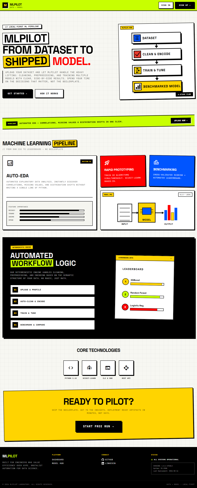
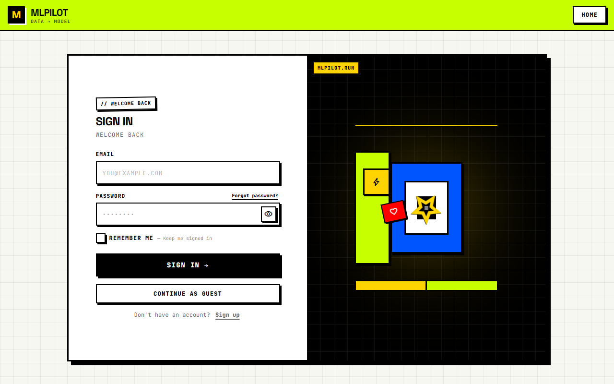
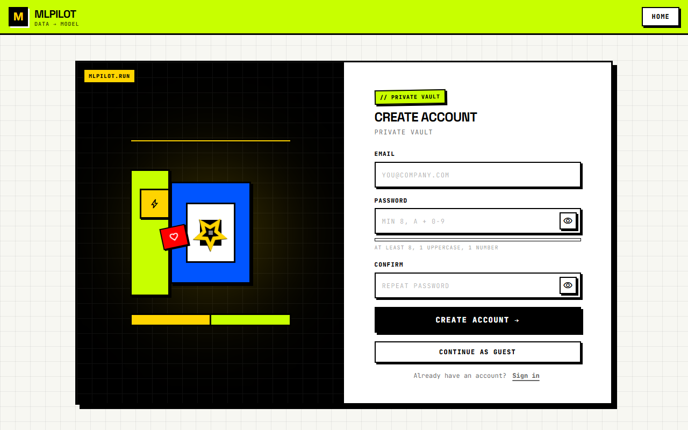
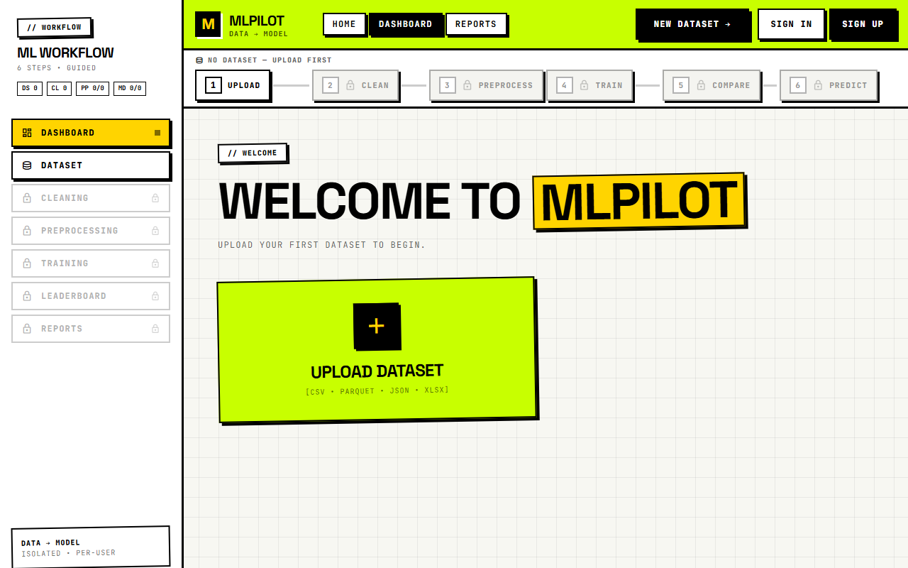
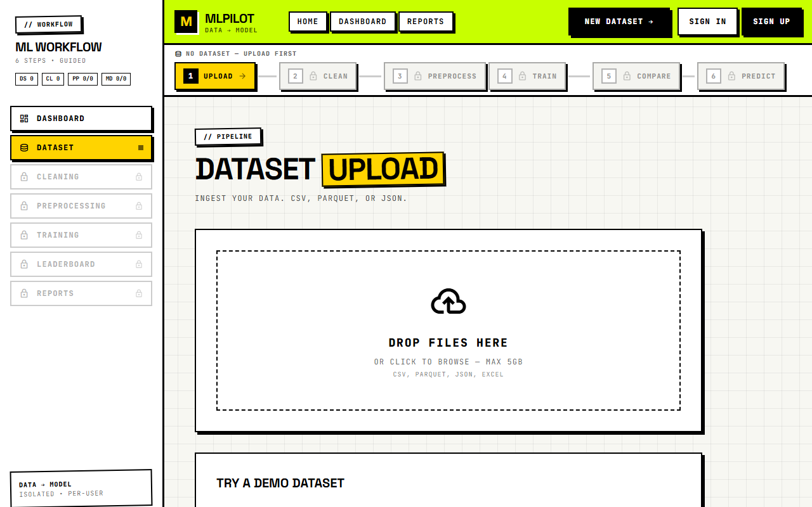

# MLPilot

[](LICENSE)

Resume-focused full-stack web application that automates the machine learning
workflow for tabular datasets. Upload a CSV (or Parquet/JSON/XLSX), run
data cleaning and EDA, build a preprocessing pipeline, train and compare ML
models, generate SHAP explanations, score new data, and export reports — all
through a responsive React UI.

> **Status:** Milestones 1, 2, 3, and 4 are complete — including per-user JWT auth with remember-me, forgot-password, and guest→user migration. Each account is isolated; no one can see another user's datasets/models.

## Tech Stack

| Layer    | Technology |
|----------|-----------|
| Frontend | React 19, TypeScript, Tailwind CSS, Vite, TanStack React Query, React Router, Recharts, Zustand, Radix UI, React Hook Form + Zod |
| Backend  | Python 3.12+, FastAPI, Uvicorn, Pydantic / pydantic-settings, SQLAlchemy 2.0 |
| ML       | scikit-learn, XGBoost, pandas, numpy, imbalanced-learn, pyarrow, matplotlib, cloudpickle |
| Storage  | SQLAlchemy database — **SQLite by default** (absolute `data/mlpilot.db` via `DATA_DIR`, `backend/app/core/config.py:35`); PostgreSQL supported via `DATABASE_URL` (`postgresql+psycopg2://`). EDA reports and cleaning runs are JSON files under `data/`; uploaded datasets and model artifacts live on filesystem under `data/`. |
| Tooling  | Ruff (Python lint), oxlint + tsc (frontend), pytest, Vitest, GitHub Actions CI |

## Architecture

```
┌────────────────────┐      ┌─────────────────────┐      ┌──────────────────┐
│  React SPA (Vite)  │─────▶│   FastAPI Backend    │─────▶│  SQL Database    │
│  localhost:5173    │      │   localhost:8000     │      │ SQLite / Postgres│
└────────────────────┘      └─────────────────────┘      └──────────────────┘
        │                          │
        │   /api  (Vite proxy / nginx)   REST API (JSON)
        └──────────────────────────┘
```

In development, Vite proxies `/api` to the backend on port 8000, so no CORS
configuration is required locally. In the Docker setup, nginx proxies `/api` to
the backend container.

### Workflow

```
Upload ─▶ Clean ─▶ EDA ─▶ Pipeline ─▶ Train ─▶ Compare ─▶ Predict / Export
 (CSV,      (6-step   (stats,  (impute,  (10 algos, (leaderboard, (score new
  Parquet,   cleaning) findings, encode,  CV,        best model,  data, SHAP,
  JSON,      async)   plots)    scale,    tuning)    plots,       recipes,
  XLSX)                        split)               reports)    downloads)
```

### Backend Structure

```
backend/
├── app/
│   ├── main.py                 # FastAPI lifespan, CORS, exception handlers, /health + /api/v1/health, auto-cleanup daemon
│   ├── db.py                   # SQLAlchemy engine + session factory (SQLite vs Postgres, StaticPool for :memory:)
│   ├── models.py               # ORM models (users, datasets, pipelines, models, training_jobs, dataset_columns)
│   ├── storage.py              # SQLStorage — CRUD over SQLAlchemy (per-user + per-session isolation, cascade deletes, guest migration)
│   ├── core/
│   │   ├── config.py           # Settings (DATABASE_URL absolute via DATA_DIR, SECRET_KEY, JWT 60m/7d, CORS, rate-limit, cleanup)
│   │   ├── security.py         # bcrypt 12, JWT create/verify, password policy, refresh expiry (1d vs 7d/30d)
│   │   ├── exceptions.py       # Domain exception hierarchy
│   │   └── io.py               # Shared dataframe reading helpers
│   ├── api/
│   │   ├── deps.py             # get_owner hybrid (JWT user_id or X-Session-ID), get_current_user, require_user
│   │   ├── errors.py           # Structured error responses + friendly validation mapping
│   │   └── v1/
│   │       ├── router.py       # Route registration (/auth, /datasets, /eda, /cleaning, /pipelines, /training)
│   │       ├── schemas/        # Pydantic request/response models (auth, datasets, pipelines, training)
│   │       └── endpoints/
│   │           ├── auth.py         # register/login/me/refresh/forgot-password (JWT + guest migration)
│   │           ├── datasets.py     # upload (auth-only), list/get/delete, demo (guest allowed, cached)
│   │           ├── eda.py          # Async EDA with progress polling
│   │           ├── cleaning.py     # Cleaning suggestions, execute, reports
│   │           ├── pipelines.py    # CRUD, execution, suggest, detect-target, score
│   │           ├── training.py     # Training, jobs/cancel, compare, plots, exports, SHAP, algorithms/recommendations
│   │           └── settings.py     # App settings
│   └── services/
│       ├── cleaning_service.py      # 6-step cleaning engine + run reports
│       ├── eda_service.py           # EDA computation + auto-findings
│       ├── preprocessing_service.py # Pipeline building, encoding, scaling, split
│       └── explainability_service.py# SHAP waterfall explanations
├── tests/                      # pytest suite (unit + integration)
│   ├── conftest.py
│   ├── test_health.py, test_datasets*.py, test_eda*.py, test_pipelines.py
│   ├── test_training*.py, test_multi_training.py, test_exports.py, test_plots.py
│   ├── test_hardening.py, test_cascade_delete.py, test_storage_atomic_write.py
│   ├── test_advanced.py, test_datasets_broken_delete.py
│   ├── helpers/, unit/, integration/
├── requirements.txt            # runtime dependencies
├── requirements-dev.txt        # dev dependencies (pytest, ruff, httpx)
├── pyproject.toml             # project metadata + ruff/pytest config
├── alembic.ini                # Alembic configured (migrations not yet committed)
└── Dockerfile
```

> The database schema is created automatically on startup via `Base.metadata.create_all` (`backend/app/db.py:39` + `backend/app/storage.py:49`). Alembic is configured (`alembic.ini`) but no migration scripts are committed yet.

### Frontend Structure

```
src/
├── App.tsx                    # Routes + QueryClientProvider (incl. /login /register)
├── main.tsx                   # Entry point
├── components/                # App shell (Layout, Sidebar, TopNav, BottomNav)
├── core/
│   ├── api/                   # Axios client (JWT + X-Session-ID) + per-domain modules (auth, datasets, eda, cleaning, pipelines, training) + errors
│   ├── config/index.ts        # API base URL (VITE_API_BASE_URL)
│   ├── hooks/useBackendReady.ts
│   └── types/api.ts           # Shared TypeScript types
├── modules/
│   ├── auth/store/authStore.ts # Zustand persist with mixedStorage (localStorage vs sessionStorage) + rememberMe
│   ├── datasets/hooks/        # useDatasets, useEDA
│   ├── cleaning/hooks/        # useCleaning
│   ├── pipelines/hooks/       # usePipelines
│   └── training/hooks/        # useTraining
├── pages/                     # Page components
│   ├── Auth.tsx, Login.tsx, Register.tsx  # Brutalist auth (split + forgot-password + remember me)
│   ├── Home.tsx, Dashboard.tsx, DatasetUpload.tsx, DatasetOverview.tsx
│   ├── Cleaning.tsx, EDA.tsx, Preprocessing.tsx
│   ├── ModelTraining.tsx, ModelComparison.tsx, Visualizations.tsx
│   ├── Results.tsx, Settings.tsx
├── shared/
│   ├── components/            # EmptyState, ErrorState, LoadingSpinner, PageHeader, Pagination, RouteGuard, AuthGuard, error boundaries
│   ├── components/ui/         # Button, Card, Badge, Input, ConfirmDialog (+ index barrel)
│   ├── schemas/               # Zod validation schemas (pipeline, training, auth)
│   └── utils/                 # cn(), format()
└── test/setup.ts              # Vitest setup
```

> The production frontend is built from `src/` into `dist/` and served by
> nginx (see `frontend/Dockerfile` and `frontend/nginx.conf`). `frontend/`
> contains only Docker/serve configuration — the source lives in `src/`.

## Setup

### Prerequisites

- Python 3.12+
- Node.js 20+
- npm

### Backend

```bash
cd backend
python -m venv .venv
.venv\Scripts\activate            # Windows
# source .venv/bin/activate       # Unix

pip install -r requirements.txt
pip install -r requirements-dev.txt   # for running tests / linting

uvicorn app.main:app --reload --port 8000
```

By default the backend uses a local SQLite database (absolute `data/mlpilot.db` via `DATA_DIR`); no
database server is required. Set `DATABASE_URL` (see `.env.example`, e.g. `postgresql+psycopg2://`) to use
PostgreSQL (Neon/Supabase in production). On Render the disk is ephemeral — Postgres persists.

### Frontend

```bash
# From the repository root
npm install
npm run dev          # starts Vite at http://localhost:5173 (proxies /api -> :8000)
```

### All-in-one (from repo root)

```bash
npm run backend      # starts the FastAPI backend via uvicorn
npm run dev          # starts the Vite frontend
```

### Docker

```bash
docker compose up --build
# Frontend:  http://localhost
# Backend:   http://localhost:8000
```

> **Caveat:** `docker-compose.yml` runs `alembic upgrade head` on startup, but
> no migration scripts are committed yet (the app auto-creates its schema via `create_all`).
> For local Docker use, comment out that step or rely on `create_all`.
> Also note the compose `DATABASE_URL` must be `postgresql+psycopg2://...` — `asyncpg` is not in `requirements.txt`.

### Production Build

```bash
npm run build        # produces dist/
```

## API Endpoints

| Method | Path | Description |
|--------|------|-------------|
| `GET`  | `/health` / `/api/v1/health` | Health check |
| `POST` | `/api/v1/auth/register` | Register (email, password, optional `guest_session_id` migration) |
| `POST` | `/api/v1/auth/login` | Login (`username=email`, `password`, `?remember_me=bool` → 1d vs 7d refresh) |
| `GET`  | `/api/v1/auth/me` | Current user (JWT) |
| `POST` | `/api/v1/auth/refresh` | Refresh tokens (`?refresh_token=`) |
| `POST` | `/api/v1/auth/forgot-password` | Forgot password (always 200 generic to avoid enumeration) |
| `POST` | `/api/v1/datasets/upload` | Upload dataset (CSV/Parquet/JSON/XLSX) — auth-only |
| `POST` | `/api/v1/datasets/demo` | Demo dataset (iris/breast_cancer/housing/digits) — guest allowed, cached |
| `GET`  | `/api/v1/datasets/` | List datasets (paginated, per-user / per-session) |
| `GET`  | `/api/v1/datasets/{id}` | Get dataset |
| `DELETE` | `/api/v1/datasets/{id}` | Delete dataset + cascade |
| `POST` | `/api/v1/datasets/{id}/eda` | Start async EDA |
| `GET`  | `/api/v1/datasets/{id}/eda` | Get EDA report/status (polling) |
| `GET`  | `/api/v1/datasets/{id}/columns` | Column stats |
| `GET`  | `/api/v1/datasets/{id}/cleaning/suggestions` | Suggested cleaning config |
| `POST` | `/api/v1/datasets/{id}/cleaning/execute` | Run cleaning pipeline |
| `GET`  | `/api/v1/datasets/{id}/cleaning/runs` | Cleaning run history |
| `GET`  | `/api/v1/datasets/{id}/cleaning/report/{run_id}` | Cleaning run report |
| `GET`  | `/api/v1/datasets/{id}/cleaning/download/{run_id}` | Download cleaned CSV |
| `POST` | `/api/v1/pipelines/suggest` | Suggest pipeline config |
| `POST` | `/api/v1/pipelines/detect-target` | Auto-detect target column |
| `POST` | `/api/v1/pipelines/` | Create pipeline |
| `GET`  | `/api/v1/pipelines/` | List pipelines (paginated) |
| `GET`  | `/api/v1/pipelines/{id}` | Get pipeline |
| `PUT`  | `/api/v1/pipelines/{id}` | Update pipeline |
| `DELETE` | `/api/v1/pipelines/{id}` | Delete pipeline |
| `POST` | `/api/v1/pipelines/{id}/execute` | Execute pipeline (background) |
| `POST` | `/api/v1/pipelines/{id}/score` | Score new data against a model |
| `POST` | `/api/v1/training/` | Train model(s) — single or multi-algorithm batch |
| `GET`  | `/api/v1/training/models` | List models (paginated) |
| `GET`  | `/api/v1/training/models/compare` | Compare models (leaderboard) |
| `GET`  | `/api/v1/training/models/{id}` | Get model |
| `GET`  | `/api/v1/training/models/{id}/download` | Download model artifact (pkl/zip) |
| `POST` | `/api/v1/training/models/{id}/set-best` | Mark model as best |
| `GET`  | `/api/v1/training/models/{id}/plots` | Diagnostic plots (confusion, ROC/PR, importance, residuals) |
| `GET`  | `/api/v1/training/models/{id}/explain` | SHAP waterfall explanation |
| `POST` | `/api/v1/training/models/{id}/predict` | Predict on uploaded file |
| `GET`  | `/api/v1/training/models/{id}/export/cleaned` | Export cleaned CSV |
| `GET`  | `/api/v1/training/models/{id}/export/preprocessed` | Export preprocessed splits (ZIP) |
| `GET`  | `/api/v1/training/models/{id}/export/recipe` | Export inference recipe (ZIP) |
| `GET`  | `/api/v1/training/models/{id}/export/report` | Executive HTML report |
| `GET`  | `/api/v1/training/predictions/download` | Download latest predictions CSV |
| `GET`  | `/api/v1/training/jobs` | List jobs (paginated) |
| `GET`  | `/api/v1/training/jobs/{id}` | Get job |
| `POST` | `/api/v1/training/jobs/{id}/cancel` | Cancel job (cooperative) |
| `GET`  | `/api/v1/training/algorithms` | List available algorithms |
| `GET`  | `/api/v1/training/recommendations` | Recommend algorithms for dataset |
| `GET`  | `/api/v1/settings/` | Get app settings |
| `PUT`  | `/api/v1/settings/` | Update app settings |

All list endpoints accept `?page=1&per_page=20`. Error responses follow a
consistent format:

```json
{"error": {"code": "VALIDATION_ERROR", "message": "...", "field": null}}
```

## Testing

### Backend

```bash
cd backend
pip install -r requirements-dev.txt
python -m pytest tests/ -v
```

### Frontend

```bash
npm test           # Vitest
npm run lint       # oxlint
npm run typecheck  # tsc -b
```

### CI Pipeline

GitHub Actions (`.github/workflows/ci.yml`) runs on every push/PR to `main`:

| Step | Command (working dir) |
|------|----------------------|
| Backend lint | `ruff check .` (backend/) |
| Backend test | `python -m pytest tests/ -v` (backend/) |
| Frontend typecheck | `npx tsc -b` |
| Frontend lint | `npm run lint` |
| Frontend test | `npm test` |
| Frontend build | `npm run build` |

## Features

- [x] Dataset upload (CSV, Parquet, JSON, XLSX) with format + size validation
- [x] 6-step data cleaning: missing values, outliers, dtype issues, constant columns, currency/date normalization, with suggestions + run reports + cleaned CSV download
- [x] Automated EDA (async): column stats, correlation heatmap, auto-findings, outliers, duplicates
- [x] Preprocessing pipelines: imputation (incl. KNN), encoding (OHE, label, target), scaling, train/test split, feature selection, imbalance handling (SMOTE / class weights)
- [x] Multi-algorithm training: 10 algorithms, cross-validation, RandomizedSearchCV tuning
- [x] Multi-model jobs with progress and lifecycle tracking (queued → running → completed/failed/cancelled) + cooperative cancellation
- [x] Model comparison leaderboard with best-model detection + set-best
- [x] Diagnostic plots: confusion matrix, ROC/PR curves, feature importance, residuals, learning curve
- [x] SHAP waterfall explainability
- [x] Predictions: score new data, download predictions CSV
- [x] Export hub: cleaned CSV, preprocessed splits ZIP, inference recipe ZIP, model artifact download, executive HTML report
- [x] Per-user JWT auth (register/login/me/refresh, bcrypt 12, 60m access) + remember-me (1d vs 7d refresh via mixedStorage) + forgot-password (generic) + guest→user migration + demo cache
- [x] Session isolation (`X-Session-ID` header, per-browser guest) + per-user isolation (`user_id` FK) — each user sees only their data; auto-cleanup daemon (disabled by default, `ENABLE_AUTO_CLEANUP=true` enables 7-day purge)
- [x] Settings API
- [x] Paginated list endpoints
- [x] Structured error responses (friendly validation: `Please enter a valid email...`)
- [x] Loading / error / empty states on all pages
- [x] Backend (pytest) and frontend (Vitest) test suites
- [x] CI pipeline (GitHub Actions)

## Roadmap

Deferred / not-yet-implemented:

- **Optuna hyperparameter tuning** — deferred via an extension point.
- **Role-based access control (RBAC)** — deferred (no roles; per-user isolation only).
- **Real-time collaborative editing** — out of scope for the portfolio.
- **Dataset versioning / diffing** — nice-to-have, not implemented.
- **Tech-debt cleanups**: `SVC probability` → `CalibratedClassifierCV` (remaining cosmetic: 3 oxlint warnings, `on_event`→`lifespan` done, Vite code-splitting done via `manualChunks`).

## Screenshots

> **Why `docs/screenshots/`?** It’s the conventional GitHub docs folder — tracked in git, *not* served as a public asset (unlike `public/` which is copied to `dist/` and exposed at `/screenshots/...`). This keeps portfolio images versioned without bloating the Vite bundle and they render in `README.md` via relative `docs/screenshots/01-home.png`. If you prefer `public/screenshots/` or `image/` we can move — just say the path.

Captured via Playwright (`npm run screenshots` → `e2e/screenshots.spec.ts` + `playwright.config.ts` using system Chrome `channel: 'chrome'`, 1280×800, guest session). All images <300KB.

| View | Screenshot |
|------|------------|
| Home — brutal hero + 4-stage flow |  |
| Login — split + AbstractPanel |  |
| Register — strength meter |  |
| Dashboard — per-user isolation |  |
| Datasets — upload + demo |  |

To re-capture locally: `npm run screenshots` (spawns backend `:8000` + Vite `:5173` via `playwright.config.ts` `webServer`, or reuse existing servers).

See `docs/screenshots/README.md` for file list + sizes.

## License

MIT © 2026 Aavesh Karigar — see [LICENSE](LICENSE).

[](LICENSE)
